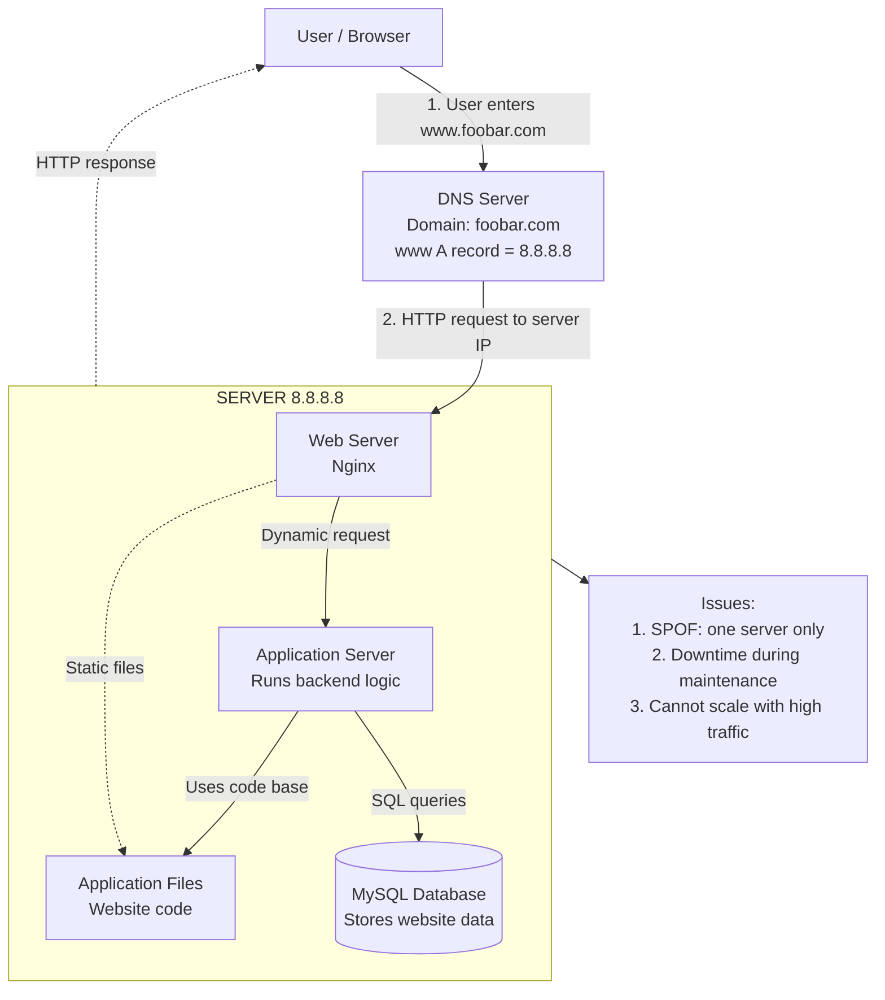

# Web Infrastructure Design

## Diagram

## Questions and Answers

| Question | Answer |
|---|---|
| What is a server? | A server is one physical or virtual machine that hosts the website components and responds to users over the network. |
| What is the role of the domain name? | The domain name makes the website easy to reach. Instead of remembering the IP address 8.8.8.8, the user can type www.foobar.com. |
| What type of DNS record is www in www.foobar.com? | www is an A record because it points directly to the server IPv4 address 8.8.8.8. |
| What is the role of the web server? | Nginx is the web server. It receives the HTTP request from the browser, serves static files, and sends dynamic requests to the application server. |
| What is the role of the application server? | The application server runs the website backend logic, processes the request, uses the code base, and talks to the database when data is needed. |
| What is the role of the database? | MySQL stores the website data and returns the required data when the application server asks for it. |
| What is the server using to communicate with the user's computer? | The server communicates with the user's computer using HTTP over TCP/IP. |
| What is SPOF in this design? | SPOF means Single Point of Failure. Since everything is on one server, if this server goes down, the whole website goes down. |
| Why can maintenance cause downtime? | If we need to deploy new code or restart Nginx or the application server, the website may stop working for a short time. |
| Why can this infrastructure not scale well? | This design cannot handle too much traffic because all requests go to one server with limited resources. |
