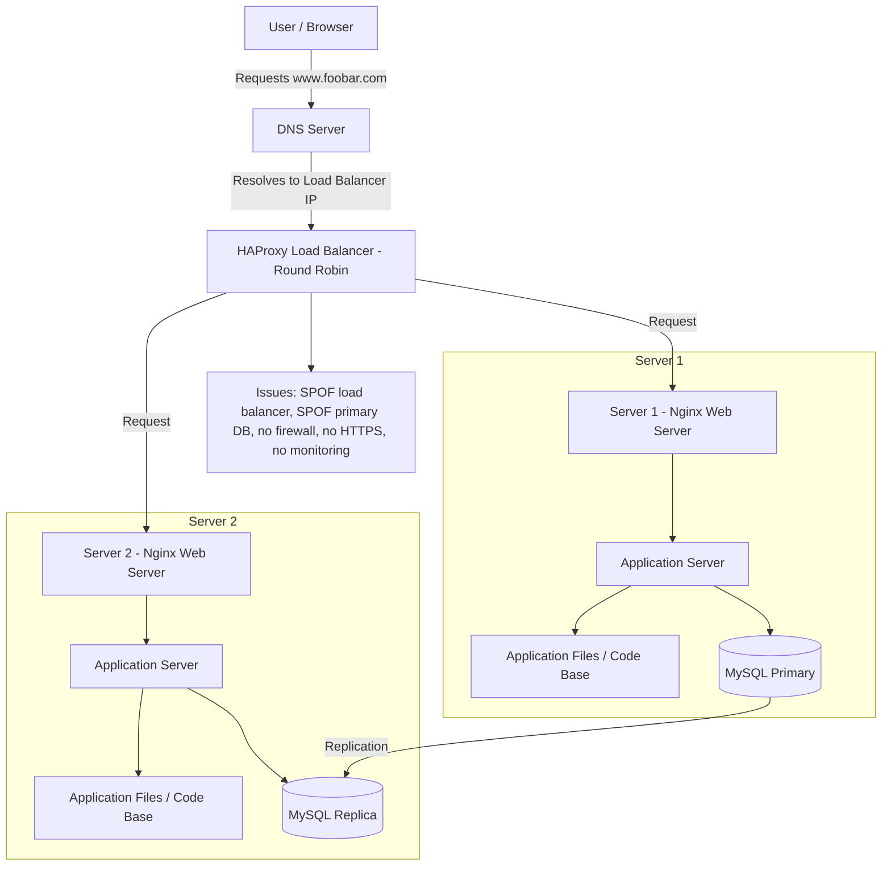

# Web Infrastructure Design

## Diagram

### Questions and Answers

### Why are we adding HAProxy?

HAProxy is added as a load balancer to send incoming requests to more than one backend server.
This prevents all traffic from going to one server and helps the website handle more users.

### Why are we adding two backend servers?

Two backend servers provide better availability and better traffic handling.
If one backend server becomes unavailable, the other server can still receive requests.

### Why does each backend server have Nginx?

Each backend server needs Nginx to receive HTTP requests from HAProxy.
Nginx can serve static files and forward dynamic requests to the application server.

### Why does each backend server have an application server?

The application server runs the backend logic of the website.
It processes user requests and communicates with the database when needed.

### Why does each backend server have application files?

Each backend server needs a copy of the application files so both servers can run the same website code.

### Why are we adding a Primary-Replica database setup?

The Primary-Replica setup is added to copy data from the Primary database to the Replica database.
This improves redundancy and can help separate write operations from read operations.

### What distribution algorithm is the load balancer using?

The load balancer is using Round Robin.

Round Robin sends requests to the backend servers one by one in order.
For example, the first request goes to Server 2, the second request goes to Server 3, then the next request goes back to Server 2.

Is this Active-Active or Active-Passive?

This is an Active-Active setup.

Both backend servers are running at the same time and both can receive traffic from HAProxy.

### What is the difference between Active-Active and Active-Passive?

Active-Active means more than one server is active and serving traffic at the same time.

Active-Passive means one server handles the traffic, while the other server waits as a backup and is used only if the active server fails.

### How does Primary-Replica database replication work?

The Primary database receives write operations such as insert, update, and delete.
After that, the changes are copied to the Replica database through replication.

### What is the difference between the Primary and Replica database?

The Primary database handles write operations.

The Replica database mainly receives copied data from the Primary and can be used for read operations or backup.

### Where are the SPOFs?

The HAProxy load balancer is a SPOF because there is only one load balancer.

The Primary database can also be a SPOF if it fails and there is no automatic failover.

### What are the security issues?

There is no firewall, so traffic is not filtered or restricted.

There is no HTTPS, so traffic between the user and the infrastructure is not encrypted.

What is missing?

Monitoring is missing.

There is no monitoring system to check server health, traffic, logs, CPU, memory, disk usage, or database status.
