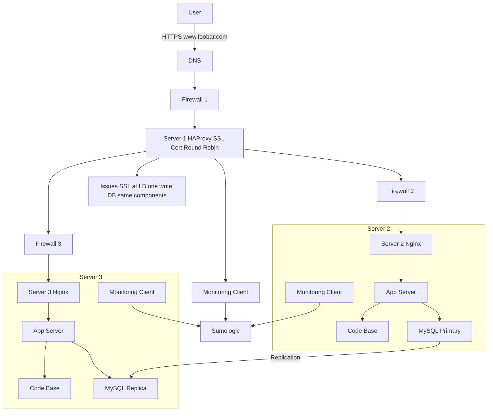

# Secured and Monitored Web Infrastructure

## Diagram

## Questions & Answers

| Question | Answer |
|---|---|
| Why are 3 firewalls added? | The firewalls are added to control and filter network traffic at different points in the infrastructure. One firewall protects the load balancer, and the other firewalls protect the backend servers. |
| What are firewalls used for? | Firewalls block unwanted traffic and allow only approved connections, such as HTTPS requests, to reach the correct servers. |
| Why is HTTPS used? | HTTPS encrypts the connection between the user and the website, so data is not sent in plain text. |
| Why is an SSL certificate needed? | The SSL certificate allows www.foobar.com to be served securely over HTTPS and helps verify the website identity. |
| Why are 3 monitoring clients added? | A monitoring client is installed on each server to collect logs, metrics, and service health information. |
| What is monitoring used for? | Monitoring is used to detect problems early, track server performance, check availability, and watch CPU, memory, disk, and network usage. |
| How does the monitoring tool collect data? | The monitoring agent runs on each server, collects logs and metrics, then sends that data to a monitoring platform such as Sumologic. |
| How can we monitor web server QPS? | To monitor QPS, we can collect Nginx access logs or Nginx status metrics and calculate how many requests are received per second. |
| Why is SSL termination at the load balancer an issue? | If SSL ends at the load balancer, traffic between the load balancer and backend servers may be unencrypted, which can be a security risk. |
| Why is having only one MySQL server accepting writes an issue? | The Primary database becomes the only server that can handle write operations. If it fails, the application may not be able to insert, update, or delete data. |
| Why can having all components on the same servers be a problem? | Running the web server, application server, and database on the same machines can cause resource competition and makes scaling each component separately harder. |
