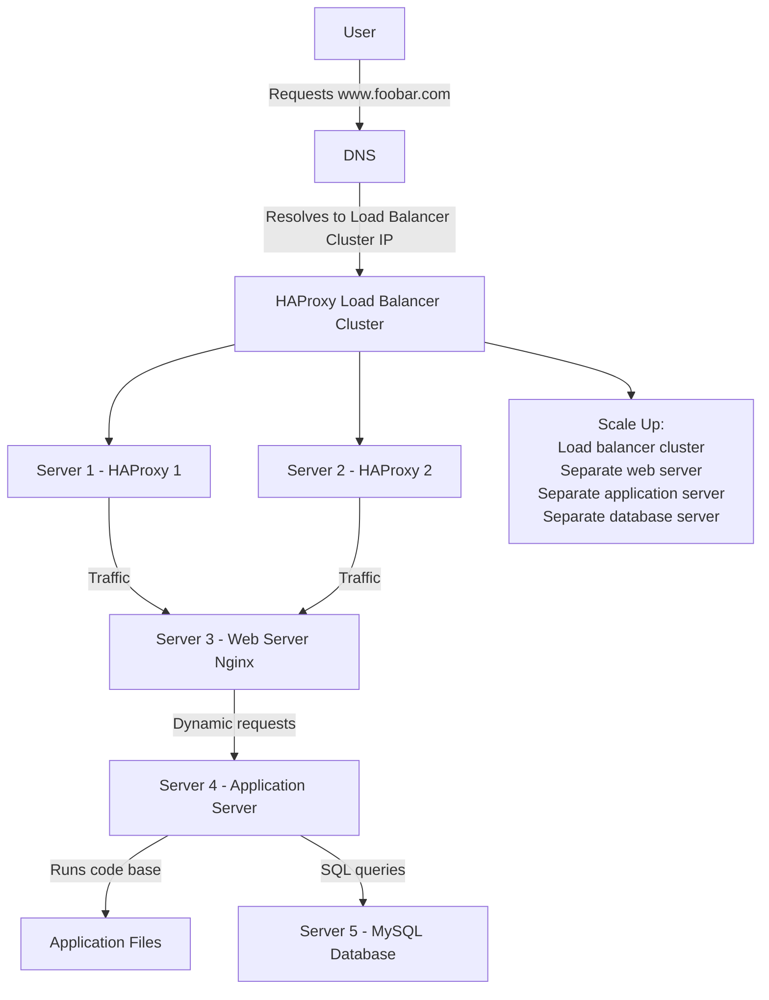

# Web Infrastructure Design

## Diagram

### Questions & Answers

### Why are we adding an extra server?

An extra server is added so the database can run on its own dedicated machine.
This separates database workload from the web and application layers, which helps reduce resource conflicts and improves performance.

### Why are we adding a second load balancer?

A second HAProxy load balancer is added to create a load balancer cluster.
This improves high availability because the infrastructure will not depend on only one load balancer. If one load balancer fails, the other one can continue routing traffic.

### Why are we splitting the web server, application server, and database?

The components are split so each layer can focus on its own responsibility instead of sharing the same server resources.

1. Web Server Layer
    The web server handles HTTP/HTTPS requests and serves static content.
    Keeping it separate makes web traffic easier to manage.
2. Application Server Layer
    The application server runs the backend logic and processes dynamic requests.
    Separating it allows the application layer to use CPU and memory without competing with the database.
3. Database Layer
    The database server stores and retrieves application data.
    Giving it its own server improves performance because database operations can use a lot of disk I/O, memory, and CPU.

### How does this design improve availability?

The second load balancer helps remove the load balancer as a single point of failure.
If one HAProxy server goes down, the other HAProxy server can still handle traffic.

### How does this design improve scalability?

Each layer can be scaled independently.
For example, more web servers can be added for more traffic, more application servers can be added for heavier backend processing, and the database layer can be optimized separately.

How does this design improve maintenance?

Each component can be updated, restarted, or maintained separately.
This makes maintenance easier because changing one layer does not always require stopping the whole infrastructure.
